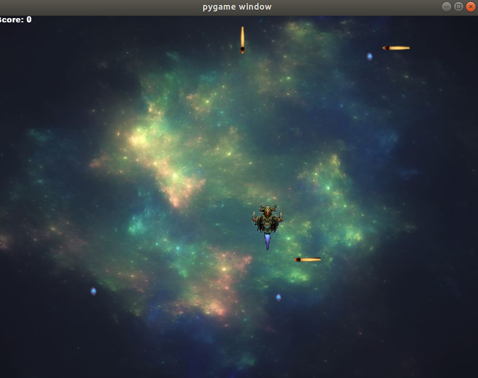
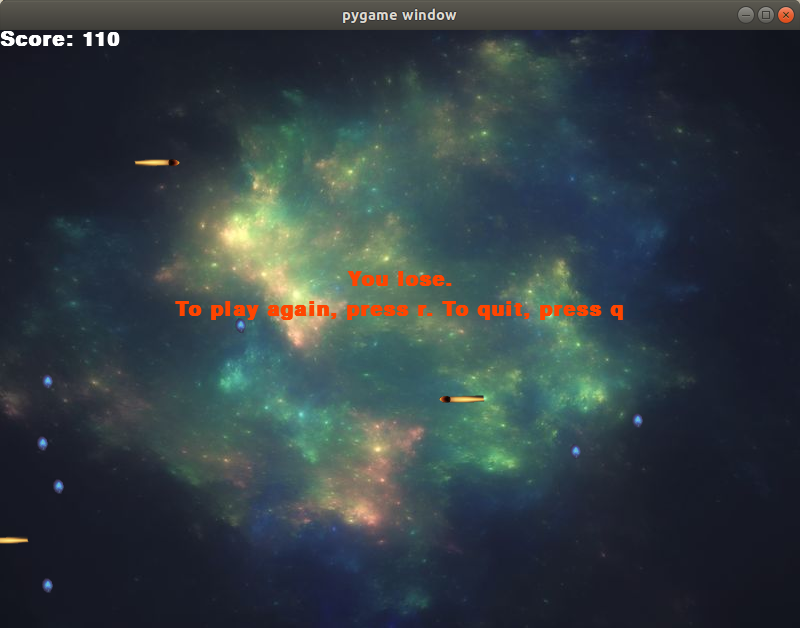

Space pygame
============

Pot au fab project is a non-profit project, was created by the [AGECA](https://www.ageca.org/) with the help 
of [Ici Lab](http://icietlab.cc/) and [Le Petit Fablab de Paris](https://lepetitfablabdeparis.fr/) 
with the sponsorship of the [Orange foundation](https://www.fondationorange.com/en).

It helps kids from local project (11th district of Paris) to get familiar with programming, teaching them to use programming tools like Python and Electronics like Arduino.

The game is run as followed:

- Spaceship looking to collect eggs
- Laser shot from left and right side, from up and down.
- Each collected eggs gives you 10 points.
- If you got hit by a laser shot, the game stops

These are the few screenshots of the game below:

Normal game

Option after you lose:

There are a list of bugs/amemdment that needs to be corrected/changed :

- Size of windows which does not fit the size of the image - done
- Cannot escape manually - done
- No message after we lose with replay option - done

The game is run on Python3 and used Pygame as a library.

 

